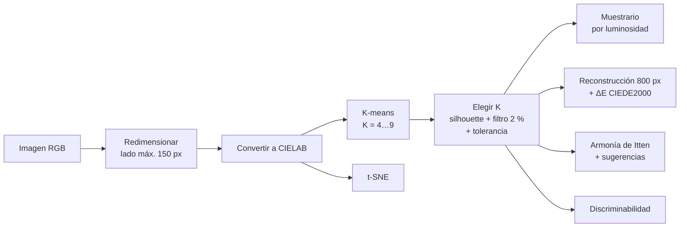

# artwork-color-palette-kmeans

Extracción automática de paletas de color a partir de obras de arte con **K-means en espacio CIELAB**. El número de colores se elige por imagen con **Silhouette Score**, y la paleta se evalúa con **ΔE CIEDE2000**, **armonía cromática de Itten** y **discriminabilidad**.

[](https://artwork-color-palette-kmeans-kfhpsaywy7fzecv6ous39o.streamlit.app)

**Demo:** https://artwork-color-palette-kmeans-kfhpsaywy7fzecv6ous39o.streamlit.app


**Stack:** Python · scikit-learn · scikit-image · Streamlit

## Qué hace la app

- Sube una obra (o elige un ejemplo) y obtén su paleta con el número de colores elegido automáticamente.
- Muestrario ordenado por luminosidad, con HEX, RGB, CMYK, Lab y proporción de cada color.
- Comparación entre la obra original y su versión pintada solo con los colores de la paleta.
- Pestañas con la elección de K, el error de reconstrucción (ΔE CIEDE2000), la armonía de Itten con sugerencias de color, la discriminabilidad y la distribución de colores en t-SNE.

Proyecto desarrollado en el curso de Aprendizaje No Supervisado de la Maestría en Inteligencia Artificial (Universidad de los Andes).

---

## Cómo funciona



| Paso | Archivo | Sección del notebook |
|---|---|---|
| Redimensionar y convertir a CIELAB (`Pipeline`) | [`palette/preparacion.py`](palette/preparacion.py) | 3 y 4 |
| K-means y elección de K | [`palette/agrupacion.py`](palette/agrupacion.py) | 5 |
| Muestrario, HEX y CMYK | [`palette/muestrario.py`](palette/muestrario.py) | 6 |
| t-SNE, reconstrucción, ΔE y discriminabilidad | [`palette/evaluacion.py`](palette/evaluacion.py) | 7, 8 y 10.3 |
| Armonía de Itten y sugerencia de colores | [`palette/armonia.py`](palette/armonia.py) | 10.2 |
| Función integradora | [`palette/pipeline.py`](palette/pipeline.py) | 9 |
| Interfaz | [`app.py`](app.py) | — |

El desarrollo paso a paso, con las pruebas y justificaciones, está en [`MLNS-microproyecto.ipynb`](MLNS-microproyecto.ipynb).

---

## Decisiones de diseño

| Decisión | Motivo |
|---|---|
| **CIELAB en lugar de RGB** | K-means usa distancia euclidiana. En RGB esa distancia no corresponde a la diferencia de color que percibe el ojo; CIELAB está diseñado para aproximarla. La paleta es para personas, así que se agrupa como percibe una persona. |
| **K-means** | El centroide es el color promedio del grupo: un color representativo que no tiene que ser un píxel exacto. Escala bien con miles de píxeles por imagen. |
| **K entre 4 y 9** | Con K = 2 o 3, las obras de alto contraste quedaban en solo "zona clara" y "zona oscura". Más de 10 colores deja de servir como muestrario práctico. |
| **Filtro del 2 %** | Descarta los K con clusters de píxeles atípicos. Se bajó de 3 % porque se perdían colores válidos. |
| **Tolerancia de 0.01** | En *San Jerónimo* (Lotto), K = 4 y K = 5 difieren en 0.008 de silhouette, pero solo K = 5 captura el rojo de la túnica. Ante un empate se prefiere el K más alto. |
| **Silhouette sobre 4.000 píxeles** | Su costo es O(n²); la muestra lo hace viable y sigue siendo representativa. |
| **`n_init=10` y semilla fija** | Reduce la dependencia de una sola inicialización y hace los resultados reproducibles. |
| **Entrenar a 150 px, reconstruir a 800 px** | Se entrena rápido y luego `predict()` asigna los píxeles de la versión grande, así la reconstrucción no se ve pixelada. |
| **ΔE CIEDE2000 para evaluar** | Corrige las zonas donde CIELAB no es uniforme; es el estándar para medir diferencia de color percibida. |
| **Filtro de croma < 10 en armonía** | En colores casi grises, el tono `arctan2(b, a)` es numéricamente inestable y distorsiona la comparación con las plantillas. |
| **t-SNE sin PCA previo** | Los datos ya tienen solo 3 dimensiones (L, a, b); PCA no aporta. |

## Hallazgos

- **K varía entre obras** (de 4 a 8 en el conjunto de prueba): se ajusta a su complejidad cromática.
- **La fidelidad no depende solo de K.** Obras con zonas de color grandes y uniformes logran ΔE bajo con K = 4, mientras que obras con pinceladas visibles tienen ΔE alto aun con K similar.
- **La armonía se evalúa mejor con pocos colores saturados:** las plantillas de Itten están pensadas para paletas de 2 a 4 colores.
- **La discriminabilidad detecta paletas difíciles de usar:** en un retrato tenebrista, dos marrones oscuros quedan casi indistinguibles.

---

## Ejecutar localmente

```bash
pip install -r requirements.txt
python -m streamlit run app.py
```

Para ofrecer imágenes de ejemplo en la app, ponlas en una carpeta `ejemplos/` con el formato `autor_titulo.jpg` (por ejemplo, `lorenzo-lotto_st-jerome.jpg`).

## Limitaciones y próximos pasos

- Todos los píxeles pesan igual, aunque sean fondo; se podría ponderar por relevancia visual.
- La armonía de Itten no se puede evaluar en paletas casi neutras (menos de 2 colores saturados).
- Las sugerencias armónicas conservan la luminosidad del color base; podrían ofrecer variantes de luminosidad.
