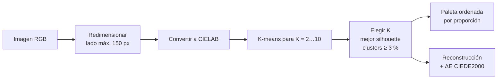

# artwork-color-palette-kmeans

Extracción automática de paletas de color a partir de obras de arte con **K-means en espacio CIELAB**. El número de colores se elige por imagen con **Silhouette Score**, y la calidad de la paleta se mide con **ΔE CIEDE2000**.

<!-- Agrega aquí una captura de la app: una obra y su paleta extraída -->

**Stack:** Python · scikit-learn · scikit-image · Streamlit

---

## Cómo funciona



| Paso | Archivo |
|---|---|
| Redimensionar conservando la proporción y convertir a CIELAB | [`palette/preprocessing.py`](palette/preprocessing.py) |
| K-means y elección de K con silhouette | [`palette/clustering.py`](palette/clustering.py) |
| Paleta, reconstrucción y ΔE | [`palette/palette.py`](palette/palette.py) |
| Interfaz | [`app.py`](app.py) |
| Desarrollo paso a paso con justificaciones | [`MLNS-microproyecto_v3.ipynb`](MLNS-microproyecto_v3.ipynb) |

## Decisiones de diseño

| Decisión | Motivo |
|---|---|
| **CIELAB en lugar de RGB** | K-means usa distancia euclidiana. En RGB esa distancia no corresponde a la diferencia de color que percibe el ojo; CIELAB está diseñado para aproximarla. La paleta es para personas, así que se agrupa como percibe una persona. |
| **K-means** | El centroide de cada grupo es el color promedio: justo un color representativo. Escala bien con decenas de miles de píxeles por imagen. |
| **K elegido por imagen con silhouette** | Cada obra tiene una complejidad cromática distinta; un K fijo sobra en unas y falta en otras. |
| **Descartar K con clusters < 3 %** | Evita "colores" de ruido que no aportan a la paleta. |
| **Silhouette sobre una submuestra de 4.000 píxeles** | Su costo es O(n²); la submuestra lo hace viable sin cambiar la conclusión. |
| **`n_init=10` explícito** | El valor por defecto cambió entre versiones de scikit-learn y puede alterar resultados sin avisar. |
| **Redimensionar conservando la proporción** | Reduce el costo sin deformar ni recortar la obra. |
| **ΔE CIEDE2000 para evaluar** | Es el estándar para medir diferencia de color percibida; corrige las zonas donde CIELAB no es uniforme. |

## Ejecutar localmente

```bash
pip install -r requirements.txt
python -m streamlit run app.py
```

Para ofrecer imágenes de ejemplo en la app, ponlas en una carpeta `ejemplos/` en la raíz.

## Limitaciones y próximos pasos

- Todos los píxeles pesan igual, aunque sean fondo; se podría ponderar por relevancia visual.
- Los colores casi grises tienen un tono inestable; conviene filtrarlos por croma antes de analizar armonías.
- Análisis de armonía cromática (modelo de Itten) y de discriminabilidad entre los colores de la paleta.
- Visualización t-SNE de la distribución de colores.
